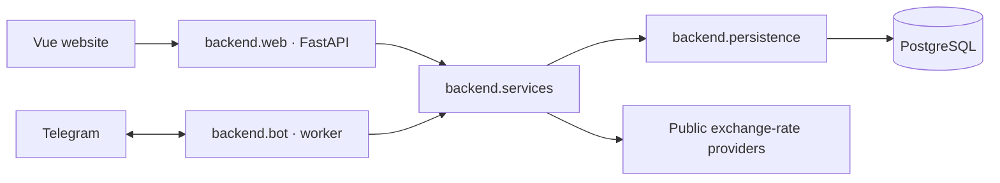

# Budgenta

**Your budget agent.**

[Source code](https://github.com/kborysovsky/budgenta) · [MIT license](LICENSE) · [Security policy](SECURITY.md) · [VPS deployment guide](docs/deployment.md)

Budgenta is a personal budgeting application with a Vue website and a Telegram companion. It supports multiple users, multiple currencies per account, income and expenses, debts, savings, goals, and scheduled reports. Financial records are encrypted before they reach the database.

**Stack:** Python 3.12+, FastAPI, SQLAlchemy, PostgreSQL 17, Vue 3, and Vite. Docker Compose runs the website, database, and optional Telegram worker. The web API and bot call the same financial services.

## Features

- **Languages:** manually choose English, Russian, Ukrainian, or Spanish using the top-right language selector or the bot’s **Language** button (`/language`). The encrypted preference is shared with Telegram reports.

- **Accounts:** cash, debit cards, credit cards, PayPal, crypto, and savings; multiple currencies per account, balance corrections, merging, archiving, and custom display order.
- **Currencies:** USD, EUR, ARS, UAH, USDT, TRX, BTC, and ETH, according to account type. Cash and cards share the same fiat currencies.
- **Transactions:** income, expenses, custom income/expense categories with an optional permanent save (including Outside Food presets), transfers between matching currencies, and exchanges across currencies/account types at a custom rate or a final received amount (with the rate calculated automatically). Deleting a mistaken transaction reverses related transfers, exchanges, or debt payments atomically.
- **Category management:** remove default or custom income/expense categories from your suggestions without changing transaction history; restore defaults at any time under **Transactions → Manage categories**.
- **Planning:** debt repayments from a selected account, goals linked to savings balances, manual savings deposits/withdrawals, and recurring fixed or remaining-balance savings transfers.
- **Budget Limits (optional):** monthly expense-category limits with one shared limit across selected currencies, web progress and over-budget tracking, and Telegram alerts at 25%, 15%, 10%, 5%, and 0% remaining. Enable budget information independently in each report and the dashboard. Expenses remain allowed when a limit is exceeded.
- **Main currency:** choose the dashboard and Telegram estimated-total currency from the dashboard gear button, including EUR and UAH. UAH reference rates update automatically and appear in the dashboard rate list.
- **Reports:** incoming/outgoing transfer statistics (including exchanges), hidden zero figures, category percentages of total spending across currencies (converted to USD) and independent daily, weekly, monthly, Current state, and dashboard settings for accounts, currencies, savings, and exchange-rate visibility. Telegram Current state sorts accounts by USD value while displaying their original currencies.
- **Telegram:** account registration and browser login approval, guided income/expense entry, transfers and custom-rate exchanges, Current state, and scheduled reports. Management stays on the website.

Translations are bundled with the application; no automatic language detection or external translation service is used. See [localization notes](locales/README.md) for adding languages.

See the [user guide](docs/user-guide.md) for financial rules and controls, and [exchange-rate documentation](docs/exchange-rates.md) for providers, caching, and partial totals.

## Project structure

```text
.
├── backend/
│   ├── bot/
│   │   ├── __main__.py          # python -m backend.bot
│   │   ├── worker.py            # Telegram polling, delivery, update receipts
│   │   └── dialogue.py          # Guided transaction menus and form state
│   ├── web/
│   │   ├── main.py              # FastAPI app, lifecycle, middleware, Vue assets
│   │   ├── auth.py              # Browser sessions and Telegram widget validation
│   │   ├── login_flow.py        # Browser-bound login challenge endpoints
│   │   └── routes/              # Accounts, auth, planning, reports, savings,
│   │                           # system configuration, and transactions
│   ├── services/               # Shared financial rules, budget limits, reporting,
│   │                           # scheduler, quotes, users, and login approval
│   ├── persistence/            # SQLAlchemy sessions, encrypted models, migrations
│   ├── core/                   # Validation schemas, encryption, calendar helpers
│   ├── tests/                  # Service, API, bot, migration, and security tests
│   ├── requirements.txt        # Runtime Python dependencies
│   └── requirements-dev.txt    # Runtime dependencies plus pytest
├── frontend/
│   ├── src/
│   │   ├── App.vue             # Application shell, navigation, shared forms
│   │   ├── main.js             # Vue entry point
│   │   ├── components/          # Shared searchable form controls
│   │   ├── features/
│   │   │   ├── accounts/       # Account layout and management components
│   │   │   ├── budgets/        # Optional limits, shared-currency usage, progress
│   │   │   ├── planning/       # Debt and goal components
│   │   │   ├── reports/        # Report preferences and previews
│   │   │   ├── transactions/   # Transfer/exchange review and confirmation
│   │   │   └── savings/        # Savings transfers and recurring rules
│   │   └── styles/             # Shared application styles
│   ├── public/                 # Static public assets
│   ├── package.json
│   └── vite.config.js
├── locales/                    # Shared Russian, Ukrainian, and Spanish translations
├── docs/                       # User guide, operations, security, exchange rates
├── scripts/                    # Encrypted backups and read-only integration checks
├── .env.example                # Configuration template; no real credentials
├── Dockerfile                  # Separate web and bot build targets
├── compose.yaml                # Local deployment with persistent PostgreSQL
└── pytest.ini                  # Test paths and Python import configuration
```

Generated `frontend/dist/`, `artifacts/`, `backups/`, caches, and local environments are ignored by version control. Test artifacts and backups are also excluded from Docker builds.

## Architecture



`web` and `bot` are transport adapters. Financial writes, ownership checks, reporting, scheduling, and valuation live in `services`. `core` contains shared schemas and utilities; `persistence` owns database sessions, models, and migrations. Shared services do not import either transport. The bot also uses persistence directly for durable update receipts and delivery state.

The web image serves the compiled Vue application and `/api` from the same origin. The bot image contains the Python backend without frontend assets. One bot worker handles Telegram polling, savings automations, report scheduling, and notification delivery; it must keep running for scheduled jobs to execute.

## Quick start with Docker

Requirements: Docker Engine with Compose v2. Run all commands from the project root.

1. Create local configuration:

   ```sh
   cp .env.example .env
   ```

2. Fill in `.env`. Use different random values for `POSTGRES_PASSWORD`, `SESSION_SECRET`, and `IDENTITY_HASH_KEY`; configure the bot username without `@` and its token from BotFather. Generate secrets locally:

   ```sh
   python3 -c "import secrets; print(secrets.token_hex(32))"
   docker run --rm python:3.12-slim sh -c 'pip install --quiet cryptography==50.0.2 && python -c "from cryptography.fernet import Fernet; print(Fernet.generate_key().decode())"'
   ```

   Use the Fernet output for `DATA_ENCRYPTION_KEYS`. Keep `.env` private.

3. Start PostgreSQL, the website, and the bot:

   ```sh
   docker compose --profile telegram up --build -d
   docker compose ps
   ```

4. Open **http://localhost:8000**. Choose **Log in with Telegram**, open the bot, compare the displayed code, approve, and return to the browser to continue. A user account is created automatically. Sign-in uses Telegram in every environment.

To run only the database and website, use `docker compose up --build -d web`. Telegram approval and scheduled jobs require the bot worker; start it before signing in.

PostgreSQL is internal to Compose, and the website listens on host `127.0.0.1:8000`. The named database volume survives restarts and rebuilds. **Do not use `docker compose down -v` unless you intend to erase the database.**

## Configuration

| Variable | Purpose |
| --- | --- |
| `POSTGRES_PASSWORD` | Compose database password; a generated hex string avoids URL-escaping issues. |
| `DATABASE_URL` | Used by native Python processes. Defaults to `sqlite:///./budget.db`; Compose supplies its PostgreSQL URL automatically. |
| `SESSION_SECRET` | Random secret of at least 32 characters for signed browser sessions. |
| `DATA_ENCRYPTION_KEYS` | Comma-separated Fernet keys; new writes use the first key. Retain older keys while records still need them. |
| `IDENTITY_HASH_KEY` | Separate random secret of at least 32 characters for user lookup. Preserve it for an existing database. |
| `TELEGRAM_BOT_TOKEN` | BotFather token; needed for Telegram login and the worker. |
| `TELEGRAM_BOT_USERNAME` | Bot username without `@`. |
| `APP_ORIGIN` | Exact browser origin, without trailing slash. Default: `http://localhost:8000`; Vite development: `http://localhost:5173`. |
| `COOKIE_SECURE` | `false` for local HTTP; `true` for public HTTPS. |
| `APP_TIMEZONE` | Savings-rule timezone and default report timezone; defaults to `America/Argentina/Buenos_Aires`. |
| `COINGECKO_API_KEY` | Optional CoinGecko Demo API key. |
| `STATIC_DIR` | Optional directory containing the Vue build; defaults to `frontend/dist` locally and `/app/static` in the web image. |

Daily reports default to 09:15, monthly reports to day 1 at 09:00, and weekly reports start disabled. Users configure their own report timezone, schedule, filters, and rate visibility on the website. Savings rules use `APP_TIMEZONE` independently.

## Local development

Requirements: Python 3.12+ and Node.js 22+. The following setup uses SQLite for development; PostgreSQL remains the deployed database. Use a separate bot token if the Compose worker is already running: only one worker may poll a given bot.

```sh
python3 -m venv .venv
.venv/bin/pip install -r backend/requirements-dev.txt
npm --prefix frontend ci
```

Fill `.env` as above. For Vite development, set `APP_ORIGIN=http://localhost:5173` and `COOKIE_SECURE=false`. Leave `DATABASE_URL` unset for local SQLite, or set it to a reachable development PostgreSQL database.

Run each command in a separate terminal, from the project root:

```sh
# API, with automatic Python reload
.venv/bin/uvicorn backend.web.main:app --env-file .env --reload

# Vue development server; proxies /api to localhost:8000
npm --prefix frontend run dev

# Telegram login and scheduled jobs; loads root .env automatically
.venv/bin/python -m backend.bot
```

Open **http://localhost:5173**. Do not run Docker and native servers on the same port simultaneously. Existing custom launch commands must use the new `backend.web.main:app` and `backend.bot` entry points; the previous `app.*` package paths have been removed.

## Tests and integration checks

```sh
.venv/bin/python -m pytest -q
node --test frontend/tests/*.test.js
npm --prefix frontend run build
.venv/bin/python scripts/check_integrations.py
```

Tests use disposable SQLite databases and test encryption keys. They cover financial invariants, ownership, encrypted storage, migrations, Telegram idempotency, API behavior, schedules, and report filters. They do not send Telegram messages. The integration script performs public rate requests and checks bot credentials/webhook status without sending messages or printing credentials.

API routes are under `/api`; writes require the exact configured `Origin` and protected endpoints require a session cookie. Public interactive documentation and schema routes are disabled. Routers are grouped by feature in `backend/web/routes/`; developers can inspect `app.openapi()` in an isolated development environment.

## Deployment and maintenance

Follow the [VPS deployment guide](docs/deployment.md) for the nginx configuration, HTTPS, firewall, trusted proxy settings, and launch checks. Existing installations using the original database names must run the [one-time database rename](docs/operations.md#upgrade-from-the-original-database-name) before rebuilding. Fresh installs use `budgenta` for both the PostgreSQL database and role.

The supplied Compose file is a single-host deployment. Before exposing it publicly, configure HTTPS at a reverse proxy, set `APP_ORIGIN` to the public HTTPS origin, and set `COOKIE_SECURE=true`. Keep PostgreSQL private. Run one Telegram worker; the worker uses a PostgreSQL advisory lock and does not silently remove an existing Telegram webhook.

Useful commands:

```sh
# Create an encrypted backup before an upgrade
.venv/bin/python scripts/backup_database.py

# Rebuild and restart application services, retaining the database volume
docker compose --profile telegram up --build -d

# Check status and logs
docker compose ps
docker compose logs --tail 100 web bot

# Stop services without deleting stored data
docker compose --profile telegram stop
```

See [operations](docs/operations.md) for upgrades, backup/restore, and troubleshooting. Startup applies versioned migrations under a PostgreSQL advisory lock. This folder reorganization does not change tables, financial records, or public API paths.

## Data protection and current limits

Financial fields use authenticated server-side encryption. A database-only dump cannot reveal their plaintext without the keys. The running application can decrypt records, so this is **not zero-knowledge encryption**. Back up encryption and identity keys separately from database backups; losing them can make records inaccessible. Telegram also stores messages sent through the bot. See [security and data protection](docs/security.md) for the exact boundary and key rotation notes.

Budgenta does not yet support live bank connections, recurring expenses, or editing transactions in place. Use deletion with reversal to correct transactions. Exchange-rate totals are estimates; unavailable currencies produce a clearly marked partial total. Tests provide regression coverage, not a security audit or a high-availability deployment guarantee.

## Working on the code

Add financial behavior in `backend/services/` and shared input validation in `backend/core/schemas.py`, then expose it through a feature router or Telegram dialogue. Keep HTTP request/cookie handling in `web` and Telegram protocol handling in `bot`. Add regression tests under `backend/tests/` for changes to money, authentication, and scheduling. Place Vue components beside related features; use `App.vue` for application composition. Update the README or focused guides whenever setup, user-visible behavior, or operational requirements change.

## Contributing and license

Budgenta is open source under the [MIT license](LICENSE). Issues and pull requests are welcome at [kborysovsky/budgenta](https://github.com/kborysovsky/budgenta). Use synthetic data in bug reports and follow the [private reporting policy](SECURITY.md) for vulnerabilities. Run the backend tests, frontend tests, and frontend build before submitting changes. Never include `.env`, database files, backups, or private financial records.
